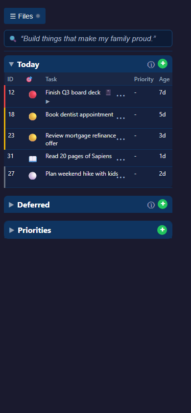
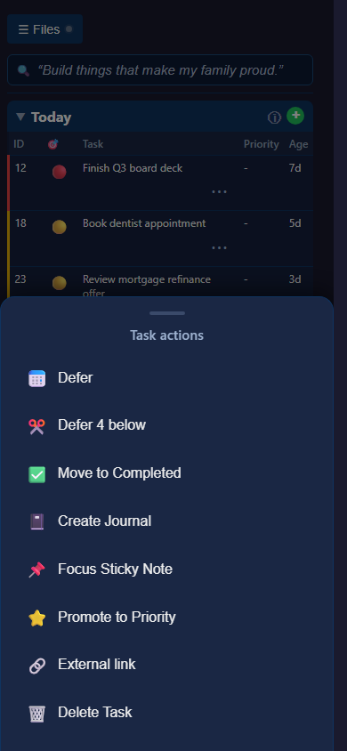
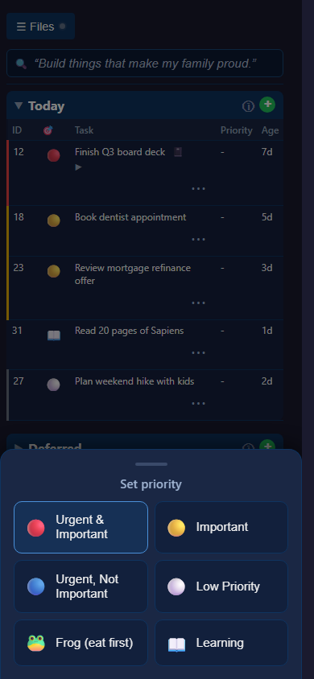

# #335 — Mobile menu prototype (bottom sheets)

On a phone the old row context-menu and the priority-orb dropdown were positioned
boxes rendered *inside* the table's scroll container. After you filter down to a
single row that container is only one row tall, so the menu opened outside it and
got clipped — you couldn't reach the actions. This prototype fixes that and makes
the actions touch-friendly.

## What changed

**A1 — visible kebab (⋯) per row.** No more hidden right-click / press-and-hold.
Each row shows a kebab at the trailing edge on mobile; tapping it opens the
actions.

**B1 — shared bottom sheet, portaled to `<body>`.** Both the row actions *and*
the priority picker now slide up from the bottom of the screen as a full-width
sheet drawn on `document.body`, so they can never be clipped by the table,
regardless of how many rows are visible. Tap the backdrop or press Esc to close.
Desktop behaviour is unchanged (it still uses the positioned menus).

## Screenshots (390×844, mobile viewport)

| | |
|---|---|
| Row list with kebabs |  |
| Row actions sheet (tap ⋯) |  |
| Priority sheet (tap the orb) |  |

## Pick

This is the recommended **A1 + B1** combination. Reply on the task journal with
"approve" to keep it, or tell me what to change (e.g. fewer priority options,
kebab on the far right, different sheet styling).
