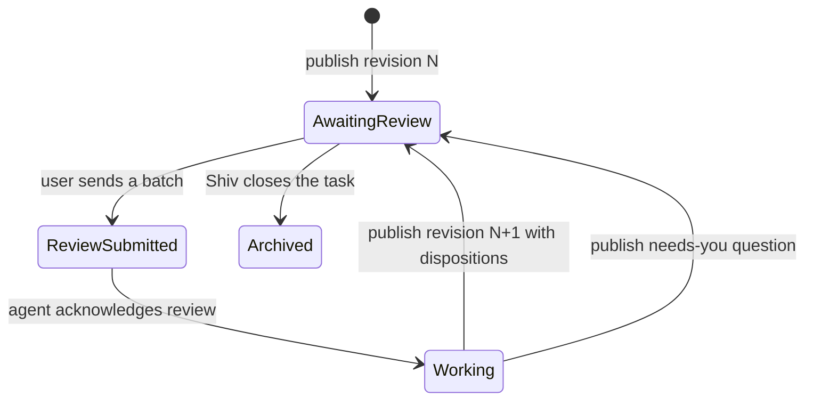

# Docs — native catch-up documents

**Bottom line.** Docs gives a task one durable catch-up document when its journal becomes long
enough to burden the next reader. The user can read the document, follow supporting-document links,
and comment on exact spans; the agent reads those comments, does the work, and publishes a new
revision with a disposition for each comment. Journals remain the source history, but after a
document exists the agent's journal turns become short pointers to it.

Docs is a separate, optional surface over the planner's existing task and journal data. It is
invisible to a user whose planner folder has no `docs/index.json`: no Docs link, UI, or additional
agent behavior appears. The presence of that file is the feature gate; there is no settings flag.
The design is deliberately conservative about ownership and preservation: each file has one
logical writer, concurrent user comments merge by comment id, and comments that can no longer be
anchored remain visible as outdated rather than being discarded.

This is the behavior contract for the Docs app, publisher, and overnight-agent integration. It
specifies behavior, not implementation. The **AGENTS.md scaffold change is not part of this
specification**; it ships with S3.

## Spec decisions

- **Q10 is provisional and reversible.** On mobile, the single task-row rail slot shows 📄 when a
  task has a primary doc; otherwise it shows 💬 when Telegram is available, or 📔 when it is not.
  The other links are in the ⋮ menu. Desktop shows the available links side by side. This decision
  may be replaced after mobile use is reviewed.
- Similarity matching for block ids is deliberately conservative: exact normalized blocks match
  first; otherwise only a unique one-to-one best match with token Jaccard similarity of at least
  0.8 carries an id. Ambiguous matches receive a new id, and comments that cannot re-anchor become
  outdated, never deleted.
- The review-set depth cap is **3 links from the primary**: the primary is depth 0 and linked docs
  at depths 1–3 are included. This makes the example cap operational and deterministic.
- “Visible word” means a Unicode letter/number word after hidden HTML comments and Markdown
  presentation syntax are removed; a word may contain internal apostrophes or hyphens. Link text
  and image alt text count; link destinations and HTML comments do not. This gives the app and
  agent one reproducible measure.
- Documents retain the most recent **20** history snapshots and revision summaries, including the
  current revision. This applies the Q8 default to both history surfaces.
- To make the unspecified phone-performance limits actionable, a published Markdown body is at
  most 256 KiB, a review JSON file and the index are each at most 1 MiB, and the bodies in one
  task's review set total at most 2 MiB. Exceeding a limit is a refusal, never silent truncation.
- The publisher-stamp check applies to publisher-owned `index.json`, `doc.md`, `response.json`,
  and history snapshots; app-owned `review.json` is not required to carry the publisher stamp.
- Desktop commenting uses the same selection, comment, and review components as mobile; phone
  usability is the test gate for v1.
- The agent-loop requirement is Node-only. In this checkout the Node state engine lives at
  `plugins/overnight-agent/skills/overnight-agent/oa-state.mjs`; do not substitute `oa-state.ps1`.
- JSON readers ignore unknown fields for forward compatibility, but writers emit only the fields
  defined here. Invalid required fields or inconsistent cross-file bindings are errors.
- A publish's files are individually atomic, not a cross-file transaction. Revision stamps detect
  an interrupted sequence; a later publisher invocation repairs the set from the highest complete
  consistent revision rather than guessing that a partial write succeeded.

## What a person sees

| Situation | Behavior |
| --- | --- |
| `docs/index.json` is absent | Nothing changes. No Docs UI, links, or agent work is enabled. |
| Journal is below threshold and has no primary doc | The task remains journal-only. |
| Journal reaches 1,500 visible words and has no primary doc | `fp-docs status` reports `threshold: reached`; the agent creates a catch-up of the whole journal on its next turn. |
| A primary doc exists | 📄 opens it. Every later agent turn updates it in place and leaves only a short pointer plus link in the journal. |
| A user reads or comments on a document | The reader marks a revision read; span comments can be drafted and sent as one review batch. There is no whole-document approval. |
| The agent responds | Its new revision contains the answer in prose and a disposition pointing to the relevant block. Each sent comment is dispositioned. |
| A comment's original text has moved | The app tries to re-anchor it; if it cannot, it remains in the Outdated view with its original quote and body. |

The task exposes one consistent trio: 💬 Telegram when a `tg-meta` URL exists, 📔 Journal, and
📄 Catch-up when a primary doc exists. The trio appears on desktop task rows, the journal view
header, and the Docs document header; the Telegram bridge posts the Docs link when the primary is
created. The Docs link is driven by the actual index binding, not by the threshold, so it never
points to a document that has not been published. A new revision or `needs-you` disposition badges
📄; the journal keeps its existing ★ unread badge.

## Terms and file layout

- **Primary doc**: the task's one catch-up doc, looked up by task id in `index.json`.
- **Supporting doc**: a doc with no task binding, included in a task's view when linked from that
  task's primary (directly or transitively).
- **Revision**: a numbered, publisher-written version of a doc body.
- **Review**: a batch of one or more user comments submitted together. A review has no verdict.
- **Disposition**: the agent's per-comment status and pointer to the response block.
- **Outdated comment**: a retained comment whose quoted text no longer exists after re-anchoring.

The planner folder contains the Docs registry and one stable-id directory per document:

> [!NOTE]
> **Technical detail: file layout.** The tree shows the publisher's on-disk organization.

<details>
<summary><strong>Show technical detail</strong></summary>

```text
docs/
  index.json
  d-7kx2m4/
    doc.md
    review.json
    response.json
    history/
      r0001.md
      r0002.md
  d-9a1c0q/
    doc.md
    review.json
    response.json
    history/
```

</details>

Document ids are stable across title and body changes. A primary doc is never replaced by a
second primary for the same task; supporting documents may be linked from multiple primaries.
`docs/index.json` is the gate and the complete library listing, so the library does not need to read
journals to render its cards.

## One writer per file

| File | Logical writer | Readers and constraints |
| --- | --- | --- |
| `docs/index.json` | `fp-docs` publisher | The app and agent read it. It binds each task to exactly one primary doc. |
| Each `doc.md` | `fp-docs` publisher | The agent supplies a draft; only the publisher validates, converts, anchors, stamps, and writes it. |
| Each `response.json` | `fp-docs` publisher | Contains revisions, comment dispositions, and the acknowledged review id. The app reads it. |
| Each `review.json` | Docs app | Multiple devices can submit or reopen comments. They merge records by comment id using folder-sync clocks and tombstones; the publisher only reads it. |
| Each `history/rNNNN.md` | `fp-docs` publisher | Immutable revision snapshot; retain the newest 20. |
| On-device unsent drafts | Docs app on that device | Never appear in synced `review.json` and do not wake the agent until Send. |

The publisher is the only writer beneath `docs/` for published artifacts. The app's only shared
write is `review.json`; its comment-record merge is the sole multi-device write case. A direct
external edit does not become an alternate writer: it remains readable, but the next publish
refuses it unless `--adopt-external-edit` is supplied.

## The four formats

The full field contract is summarized in [Data-Formats](Data-Formats); machine-readable schemas
are in [`schemas/`](schemas/).

### `index.json` — registry and task binding

Root fields:

| Field | Rule |
| --- | --- |
| `version` | Required integer `1`. |
| `tasks` | Required object keyed by canonical positive decimal task id (no leading zero); each value is the primary doc id. |
| `docs` | Required object keyed by doc id; each value describes one doc. |

Each `docs[id]` entry has required `title` (non-empty), `primary` (boolean), `rev` (integer ≥ 1),
`updatedAt` (UTC ISO-8601 timestamp), `links` (unique doc ids, in document order), and optional
`task` (positive integer), `telegramUrl` (well-formed URI copied from the task journal's `tg-meta`),
and `openDispositions` (`needs-you` to a nonnegative count).

A primary has `primary: true`, a `task`, and exactly one matching `tasks[task] = id` entry.
A supporting doc has `primary: false` and no `task` or `telegramUrl`. Every task binding points to an existing
primary, and no task may have two primary ids. Links may form cycles; traversal handles them.
`openDispositions` summarizes still-open `needs-you` dispositions for library badges;
comments remain authoritative in each `review.json`.

### `doc.md` — rendered body and stable block anchors

The first line is one publisher-owned HTML comment:

> [!NOTE]
> **Technical detail: revision stamp.** This marker is not visible in the rendered document.

<details>
<summary><strong>Show technical detail</strong></summary>

```text
<!-- docs v1 id=<doc-id> rev=<positive-integer> published=<UTC-ISO-8601> by=fp-docs -->
```

</details>

It is followed by one H1 title and the body in the journal renderer's Markdown subset. Raw HTML
is refused except for valid HTML comments. Supported visible blocks include headings, paragraphs,
lists and checkboxes, tables, blockquotes, fenced code, inline emphasis/code, and links; journal
`TODO:`/`DONE:` prefixes remain text/task markers. The first visible body line of a primary is a bold
status sentence. The catch-up body follows the required structure, in order: bold **Status line**; **What this is,
with no prior context**; **Why it matters**; **What changed / what was done**; **Evidence**; and
**Where it stands**. Omit a section only when it genuinely does not apply; **Appendix** is optional.
Every verified, fixed, or done claim links to evidence. Bare `#NNN` references are not allowed;
they must be links or ordinary
prose that does not look like an unlinked task id.

The publisher places one `<!-- @bN -->` comment immediately before each rendered Markdown block.
Block ids are positive integers, allocated in document order and never reused within a doc.
Headings, paragraphs, list items, table rows, blockquotes, and code blocks are independently
anchorable rendered blocks. Metadata comments and block markers are not visible blocks.
`doc:<id>` is an in-app link; standard well-formed external links remain external.

#### Block carry-over and comment re-anchoring

On publish, the publisher matches old and new rendered blocks one-to-one:

1. Normalize visible text to Unicode NFC, lowercase, collapse whitespace, and remove punctuation
   for comparison. Match exact normalized blocks first, only where the match is unambiguous.
2. For remaining blocks, compute token-set Jaccard similarity. Carry an old id only if the pair
   is each other's unique highest-scoring match among unmatched blocks and scores at least 0.8.
   Resolve all such mutual pairs, then repeat on the remaining blocks.
3. Allocate never-before-used ids for unmatched new blocks. An unmatched old id is retired, not
   assigned to a different block merely to preserve its number.

An anchor combines the block id with a W3C TextQuote selector: the exact selected `quote`, with
optional `prefix` and `suffix` context.

For each comment, anchor resolution tries the original quote in its original block, then the
same exact quote anywhere in the current doc. A unique match is displayed at that location; an
ambiguous or absent match is **outdated**. `anchor` keeps the user's original quote and context so
the app can retry on later revisions and show what the user selected. Re-anchoring never changes
comment intent or text, and outdated comments remain in `review.json` and the comments panel
until explicitly resolved or reopened. Multi-block selections store both `block` and `endBlock`.

### `review.json` — user comments and read state

Root fields: `version: 1`; `comments`, keyed by comment id; `reviews`, keyed by review id; and
`readRev`, the highest revision the user has marked read.

A sent comment requires:

| Field | Rule |
| --- | --- |
| `rev` | Positive revision on which the user made the selection. |
| `anchor` | `block`, exact selected `quote`, and optional `endBlock`, `prefix`, `suffix`. |
| `intent` | `approve`, `question`, `do-more`, or `note`. Approval applies only to the selected span. |
| `body` | User's comment text; may be empty for a one-tap approval. |
| `createdAt` | UTC ISO-8601 timestamp. |
| `reviewId` | Id of a submitted review batch. Absence means a device-local draft and is not valid in synced `review.json`. |
| `status` | `open` or `reopened`. |
| `clock` | Nonnegative integer logical record clock used by folder-sync merge. |

Reopened comments also carry `reopenedAt` and `reopenedRev`. `reviews[id]` records `submittedAt`
and the document `rev` reviewed. Sending drafts assigns them a shared review id and writes them
together; before Send, drafts stay on that device and the agent is not woken.

When writes race, a provider's If-Match/ETag is conditional: after a 412, the app fetches the latest
file, merges comment records by id and clock, and retries against the fetched version. For the same
comment id, the higher clock wins; equal clocks use folder-sync's deterministic content tie-break.
Different comment ids survive together. `readRev` takes the maximum. Review batch records are
unioned by id, with the local record taking precedence only when the ids conflict. A delete is a
tombstone, so a stale replica cannot resurrect an explicitly deleted record; normal UI disposition
does not delete comments. Before committing a send/reopen, the app checks the 1 MiB review-file
limit; if exceeded, it preserves unsent drafts on-device and explains that the review must be
reduced before sync.

### `response.json` — publisher revisions and dispositions

Root fields: `version: 1`, current `rev` (integer ≥ 1), `revisions` (newest 20 revision summaries),
`dispositions` keyed by comment id, and optional `ackedReview`.

Each revision summary has `rev`, UTC `at`, and `summary`. The array is ordered newest first and
includes the current revision. Each disposition has a `status` of
`answered`, `done`, `needs-you`, or `declined`; the revision that made it; one or more response
`blocks`; and optional short `note`. The answer itself belongs in `doc.md`, not only in `note`.
`answered`, `done`, and `declined` resolve a comment. `needs-you` returns a question to the user
and remains open. Reopening a resolved comment makes its later `reopenedRev` take precedence over
an older disposition. `ackedReview` names the last submitted review the agent claimed.

The `doc.md` stamp, `response.json.rev`, and corresponding `index.json` entry revision must agree
for a complete publish. Disagreement indicates an interrupted write and is repaired by the next
publisher run.

## Threshold: when a catch-up document starts

One shared `journalReadLoad()` measure counts the visible words in the whole task journal after
HTML comments and marker metadata are stripped. The default threshold is **1,500 words**, about a
six-minute read, configurable by “Catch-up doc threshold” in `user-settings.md`. The count is inclusive: 1,500 reaches the threshold; 1,499 does not. After the renderer removes
Markdown delimiters, it counts Unicode sequences of letters or numbers, optionally joined by an
internal apostrophe or hyphen. Headings count by their visible words; link destinations and HTML
comments do not.

At the end of each agent turn, `fp-docs status --task N` reports the count and whether the
threshold is reached. If it is reached and there is no primary doc, the agent's **next** turn
publishes a catch-up of the entire journal so far. `publish` refuses a below-threshold first
primary unless `--force`; it always refuses to create a second primary. Once a primary exists,
each agent turn updates it in place regardless of later journal size, and the journal receives
only a brief pointer and link.

## Review set and link traversal

For task `N`, the review set contains the primary doc in `index.json.tasks[N]`, plus every doc
reachable through its `doc:` links to depth 3. The primary is depth 0. Traversal reads only
`index.json`, is cycle-safe, visits each doc id once, and does not follow links beyond depth 3.
Missing targets are not silently substituted; `lint` and `publish` report them.

`fp-docs comments --task N` returns open and reopened comments across this set, grouped by doc,
after applying the anchor rules above. A submitted review on any doc in the set wakes its task.
A supporting doc reachable from two task primaries can wake both tasks; its comments and
dispositions are stored once on that doc, so the first run to resolve one makes the disposition
visible to the other. Publishing a primary and newly linked target together is one publish call,
so a new link never intentionally precedes its target.

## Lifecycle

State is derived from the files; it is not stored as a second state machine.

> [!NOTE]
> **Technical detail: lifecycle transitions.** The diagram shows the derived states and the publish/ack events.

<details>
<summary><strong>Show technical detail</strong></summary>



</details>

There is no whole-document “approved” state. A user may approve a span, and that approval
authorizes only the proposal represented by that span. If it explicitly names an action covered
by an agent-gate “always ask” rule, it answers that ask; vague approval does not. It never closes
the task. Only Shiv closing a task archives the primary; a supporting doc is archived when no
live primary links to it. Archive policy does not delete comments or revisions.

## Docs app and the three-link task surface

Docs is a separate, phone-first installed app (`docs.html` and its own web manifest) on the planner's
origin, sharing the existing storage provider, sign-in, and cache. It does not import the main
planner app module. Deep links identify a doc and optionally a block or comment; the task chip links
back to the task in Focus Planner.

- **Library:** Needs you (unread revisions, `needs-you`, or local unsent drafts), Recent, and All.
  Cards show title, task if any, revision/time, unread, needs-you, and open-comment badges.
- **Reader:** status banner, changed blocks since `readRev`, doc links, outline, version history,
  and comments. A history entry opens that revision with changes highlighted. `readRev` advances at
  end-of-document or on Mark read.
- **Comments:** long-press a selection for 💬 Comment or one-tap ✅ Approve; if native selection
  fails, tap-hold a paragraph. A bottom sheet offers approve, question, do-more, and note intents
  plus Save draft. Highlights do not mutate document content; if native text highlighting is
  unavailable, use a `<mark>` fallback. The panel distinguishes Open, Outdated, and Resolved and
  can reopen a resolved comment. Send batches drafts so the agent wakes once for the batch.
- **Task links:** desktop shows the available Telegram, Journal, and Catch-up icons side by side.
  Mobile follows provisional Q10 in Spec decisions. The Telegram URL is copied from the journal's
  `tg-meta` into `index.json`; the bridge posts the doc link once when the primary is created. In
  Telegram, the open thread is the 💬 surface and the journal and catch-up URLs link to the other two.

## `fp-docs` publisher contract

`fp-docs` is a Node CLI in the overnight-agent plugin, wrapped by a `docs-publish` skill. It builds
on the sanctioned Node write-tool conventions in `write-turn.mjs`. Drafts come from the caller's
workspace; the Docs root is resolved from configuration and is never accepted as a command-line
path. Agent reads of docs are allowed; comments are consumed through `fp-docs comments`.

| Command | Contract |
| --- | --- |
| `publish --task N --draft FILE --summary TEXT [--base-rev R] [--linked …] [--disposition …]` | Create/update the task's primary and any supporting docs; validate, convert, anchor, disposition, snapshot, stamp, and update the index. `--base-rev` protects against stale edits. `--force` permits a below-threshold first primary. `--partial --reason TEXT` permits leaving comments undispositioned with an explicit reason. `--adopt-external-edit` explicitly adopts a hand-edited doc. |
| `lint --draft FILE` | Run the same encoding, grammar, contract, link, and size validation without writing. |
| `status --task N [--json]` | Report visible journal word count and threshold state, primary and linked-doc state/revision/read status, and open counts. |
| `comments --task N [--json]` | Return open/reopened comments over the review set, grouped by doc and re-anchored for display. |
| `ack --task N --review ID` | Claim a submitted review in `response.json`; this derives the Working state and wakes no unrelated task. |

`--linked new:<alias>=FILE` creates a supporting doc and rewrites `doc:new:<alias>` references to
its generated id. `--linked <id>=FILE --linked-base-rev R` updates an existing linked doc with
optimistic concurrency. A primary's links and a newly created target are published by the same
command.

### Validation and errors

Every refusal exits non-zero, leaves the last complete published revision readable, and reports
the file/field or comment id plus a corrective action. `lint` applies draft validation; only
`publish` applies binding, concurrency, disposition, and external-edit checks.

| Code | Refuse when | Recovery |
| --- | --- | --- |
| `D01 encoding` | Input is not valid UTF-8, has a BOM, contains a known replacement/mojibake corruption marker, or uses CRLF instead of LF. | Save as UTF-8 without BOM and LF; restore corrupted source characters. |
| `D02 grammar` | Markdown is outside the journal renderer subset or contains raw HTML other than comments. | Convert unsupported markup to supported Markdown. |
| `D03 catch-up` | A primary lacks a bold status sentence directly after its title, omits a required section, contains a verified/fixed/done claim without an evidence link, or contains a bare `#NNN`. | Fix the listed contract violation; link claims to evidence. |
| `D04 link` | A `doc:` target is missing and not created in the same publish, or an external link is malformed. `--check-links` additionally checks reachability. | Fix the target or URL; publish new linked targets in the same call. |
| `D05 disposition` | An open/reopened comment anywhere in the review set has no disposition and no valid `--partial --reason`. | Add a disposition or explicitly identify why work is partial. |
| `D06 concurrency` | Supplied `--base-rev` differs from the current revision, or the linked-doc base revision is stale. | Read current state and republish against its revision. |
| `D07 size` | A body exceeds 256 KiB, the index or a review file exceeds 1 MiB, or review-set bodies total more than 2 MiB. | Reduce the draft or linked set; do not truncate silently. |
| `D08 binding` | A task already has a primary, or a first primary is below threshold without `--force`. | Update the bound doc; wait for threshold or pass `--force` intentionally. |
| `D09 data` | JSON is malformed, schema-invalid, or cross-file revision/task bindings disagree and cannot be repaired from a complete snapshot. | Repair the named field/files; do not hand-edit around the consistency check. |
| `D10 external edit` | Current `doc.md` differs from its publisher stamp/snapshot without `--adopt-external-edit`. | Review the edit, then explicitly adopt it or restore publisher output. |
| `D11 linked input` | A new alias is duplicated/invalid, an existing linked doc is missing, or required linked base revision is absent. | Use a unique alias or correct id and base revision. |

Encoding corruption markers in D01 include U+FFFD replacement characters and common UTF-8
mis-decoding sequences such as `Ã`, `Â`, `â€`, `ðŸ`, and `�`. A match is a refusal requiring
human correction, not an automatic text replacement. Size limits are configuration constants
shared by `lint` and `publish`; changing a limit is a compatibility decision and must be reflected
in this spec.

Format conversion preserves information: `<details>` becomes the supported fold marker or is
flattened; GitHub alerts become labelled blockquotes; smart quotes and `<br>` normalize to
readable Markdown; block ids are assigned/carried and block hashes support change highlighting.
Tables are never silently dropped. External links remain valid; old Google Docs stay reachable.

Q7's conservative migration default is to dual-publish to Google Docs and Docs for one week, then
import unresolved Google comments as outdated comments and add a link to the old Google Doc in the
primary before cutting over. GitHub issue handling remains out of scope for v1.

### Write and recovery protocol

The publisher validates all inputs before writing. It writes a temporary file in the target
directory and atomically renames it into place. Before replacing a body it snapshots the prior
published revision in `history/`, then retains only the newest 20 snapshots. Files are committed
in this order: `doc.md`, `response.json`, then `index.json`. The same revision appears in the body
stamp, response, and index entry. On the next run, a mismatch is treated as a torn write; repair
uses the latest complete history/response pair and then repairs the index. It never invents a
revision from a partially written body.

The publisher stamp identifies a body as publisher-written. A repository check flags changes to
publisher-owned artifacts under `docs/` without that stamp; app-owned `review.json` is exempt.
An optional pre-tool hook may block direct agent writes to the planner folder except through
`fp-docs` or the sanctioned `write-turn.mjs` tool. Checks and hooks do not change the rule that
the publisher owns all published Docs files.

## Agent-loop contract

The Overnight Agent targets the **Node engine**, currently
`plugins/overnight-agent/skills/overnight-agent/oa-state.mjs`, plus
`plugins/overnight-agent/skills/overnight-agent/write-turn.mjs`. It does not target `oa-state.ps1`.

1. After each turn, query `fp-docs status --task N`. If the journal has crossed the threshold and
   there is no primary doc, create it on the next turn; never create one twice.
2. `oa-state.mjs scan` emits `docs_review_submitted` for submitted reviews on any doc in a task's
   review set newer than that doc's `ackedReview`. Local reads distinguish an actual empty review
   from a transport failure, and the scan includes parked tasks.
3. Run `fp-docs ack`, read comments through `fp-docs comments`, do the work, and publish a revision
   with dispositions. A `needs-you` disposition is a blocking ask.
4. Once a doc exists, write only a one-line journal pointer plus the doc link using
   `write-turn.mjs`, then mark the task; the full status and answer live in the doc.
5. A span approval authorizes only that span's explicit proposal, subject to the agent-gate rule
   described above. It is not approval of the whole doc or task completion.

The `index.json.tasks` map replaces title search and Google-doc-id mapping for task binding.
Google Docs-specific workarounds, GitHub-issue handling, gh-issue-work changes, and the S3
`AGENTS.md` scaffold update are outside this v1 contract.

## Test vectors

These vectors are normative. A clean implementation must produce the stated result without
depending on repository implementation details.

### T1 — threshold measure

Input journal's entire visible text contains exactly 1,499 instances of `word`, plus an HTML
comment containing `<!-- hidden word word -->`.

| Measure | Expected |
| --- | --- |
| Visible word count | 1,499; the hidden words and Markdown heading marker are not counted. |
| Threshold state at default 1,500 | `not-reached`. |
| Add one visible `word` | Count 1,500; `reached`. |
| Agent action | `status` reports reached; first primary is published on the next turn, not retroactively in the current turn. |

### T2 — block-id carry-over

Previous blocks: `b1: "A fixed rate is 5.9%."`, `b2: "Fees are paid at closing."`.
New blocks: `"A fixed rate is 5.9%."`, `"The appraisal costs $400."`, `"New option C."`.

| New block | Expected id |
| --- | --- |
| Exact first block | `b1` carried. |
| Changed appraisal block | Its token-Jaccard score against `b2` is below 0.8, so it receives next unused id `b3`. |
| New option | `b4`. |
| Retired id | `b2` is not reused; its comments remain and are re-anchored or marked outdated. |

### T3 — re-anchoring

At revision 3, comment `c_a` selects quote `fixed 30-year at 5.9%` in `b7`; prefix and suffix
identify its original position. At revision 4, `b7` has changed but the exact quote occurs once
in `b9`.

| Attempt | Expected |
| --- | --- |
| Quote in original block `b7` | No match. |
| Exact quote anywhere | Unique match in `b9`; display the comment on `b9`. |
| Stored comment | Original `anchor` and body remain unchanged. |
| If the quote is absent or occurs twice | Mark as outdated in the UI; keep the comment and quote in `review.json`. |

### T4 — review-set traversal

Index links: primary `p` links to `a,b`; `a` links to `c,p`; `b` links to `c,d`; `c` links to `e`;
`d` links to `z`; depth cap is 3. Task 10 maps to `p`.

| Traversal | Expected |
| --- | --- |
| Depth 0 | `p` |
| Depth 1 | `a,b` |
| Depth 2 | `c,d` (visit `c` once) |
| Depth 3 | `e,z` |
| Follow `e`/`z` links | No; depth cap reached. |
| Cycle `a → p` | Stop; `p` is visited once. |
| `comments --task 10` | Open/reopened comments from `{p,a,b,c,d,e,z}`, grouped by doc. |

### T5 — review merge: If-Match and folder-sync records

Device A reads ETag `E0`, creates `c_a` clock 100, and submits with `If-Match: E0`. Device B has
already submitted `c_b` clock 101, changing the ETag to `E1`; A receives HTTP 412.

| Step | Expected |
| --- | --- |
| A after 412 | Fetch latest (`E1`); do not overwrite it with A's stale whole-file snapshot. |
| Merge records | Both `c_a` and `c_b` survive because IDs differ; each retains its own record and clock. |
| Retry | Write merged review with `If-Match: E1`; on another 412, fetch and merge again. |
| Same id on both devices | Higher `clock` wins; equal clocks use the deterministic folder-sync content tie-break. |
| `readRev` values 3 and 4 | Merged `readRev` is 4. |
| Matching review id | The local submitted-review record takes precedence; distinct review ids are retained. |

### T6 — validation refusals

For each row, run the indicated `lint` or `publish` with otherwise-valid inputs. Expected: non-zero
exit, actionable diagnostic naming the error and offending field/input, and no partial published
revision.

| Case | Invalid input | Expected error |
| --- | --- | --- |
| V1 | Malformed UTF-8 bytes | `D01 encoding`; no write. |
| V2 | UTF-8 BOM | `D01 encoding`; no write. |
| V3 | `café` corrupted as `café`, or U+FFFD | `D01 encoding`; no automatic replacement. |
| V4 | CRLF draft | `D01 encoding`; require LF. |
| V5 | Raw `<div>` in the body | `D02 grammar`. |
| V6 | Unsupported Markdown construct | `D02 grammar`; identify unsupported construct. |
| V7 | Primary lacks bold status line | `D03 catch-up`. |
| V8 | Primary omits required section | `D03 catch-up`; name section. |
| V9 | “Verified” claim without evidence link | `D03 catch-up`; name claim. |
| V10 | Bare `#123` | `D03 catch-up`. |
| V11 | `doc:d-missing` not created in this call | `D04 link`. |
| V12 | Malformed external URL | `D04 link`. |
| V13 | Unreachable external URL with `--check-links` | `D04 link`; without `--check-links`, only syntax is checked. |
| V14 | Open comment lacks disposition, with no partial flag | `D05 disposition`; name comment id. |
| V15 | Same comment omission with `--partial` but no reason | `D05 disposition`. |
| V16 | `--base-rev 3` while current rev is 4 | `D06 concurrency`; report expected/current rev. |
| V17 | Existing linked doc base revision is stale | `D06 concurrency`; report expected/current rev. |
| V18 | Draft exceeds 256 KiB | `D07 size`; no truncation. |
| V19 | New primary for task already bound | `D08 binding`. |
| V20 | First primary below 1,500 words without `--force` | `D08 binding`. |
| V21 | Invalid JSON or missing required field | `D09 data`; identify file/field. |
| V22 | `doc.md` stamp rev 4 and response rev 3, with no complete repair source | `D09 data`; do not guess the successful revision. |
| V23 | Task map points to a supporting doc or a different task's primary | `D09 data`; identify the inconsistent binding. |
| V24 | Body changed outside publisher, no adopt flag | `D10 external edit`. |
| V25 | Duplicate or malformed `new:` alias | `D11 linked input`. |
| V26 | Existing linked doc id does not exist | `D11 linked input`. |
| V27 | Update linked doc without required base revision | `D11 linked input`. |
| V28 | A body is 256 KiB + 1 byte, or review-set bodies exceed 2 MiB | `D07 size`. |
| V29 | `index.json` or one `review.json` exceeds 1 MiB | `D07 size`. |

### T7 — adoption and safe publish ordering

Current primary is revision 4. A user edits its body outside `fp-docs`; the draft is otherwise
valid and based on revision 4.

| Invocation | Expected |
| --- | --- |
| Publish without `--adopt-external-edit` | Refuse with `D10`; retain current readable files. |
| Publish with `--adopt-external-edit` | Validate the external body, preserve it as the adoption base, publish revision 5, write the new body and response before the index, then stamp all three as revision 5. |
| Simulated interruption after response write | Index still shows revision 4; next invocation detects mismatch and repairs from the latest complete pair without treating a partial index/body as success. |
