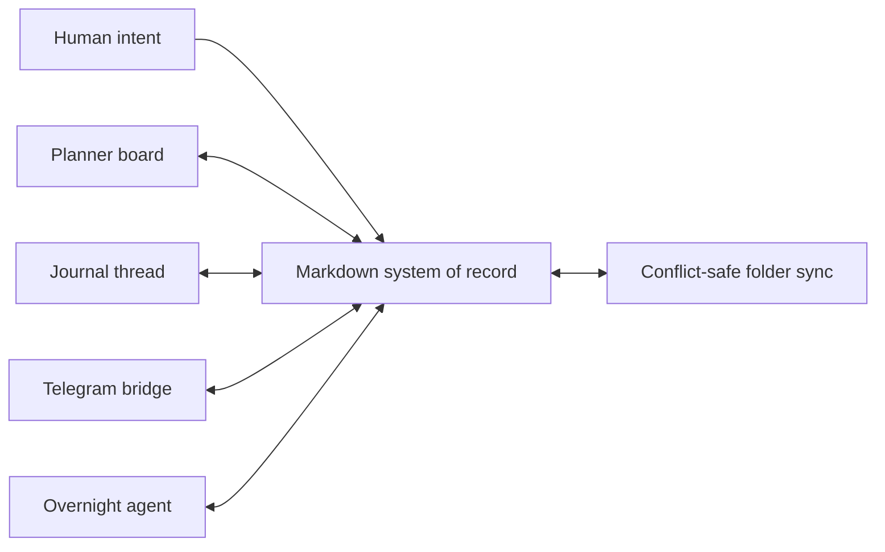
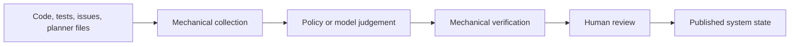

# Technical Architecture

This page is the optional architectural companion to the product-facing specification. The other
pages explain what people experience and why the system behaves that way; this page shows the ideas
that let several interfaces share one planner safely. It deliberately contains no implementation
code, signatures, or copyable snippets. Readers looking for concrete file formats can opt into the
collapsed examples on [Data Formats](Data-Formats).

## One human-readable source of truth

The planner treats markdown as the durable record rather than as an export from a private database.
That choice keeps the work legible and recoverable when the browser, an automation, or a hosted
service is unavailable. Every interface therefore acts as another view over the same information,
not as an owner of a separate copy.

The governing principle is **shared meaning before shared storage**. A board, journal, Telegram
reply, and overnight run are safe together only when they agree on what each section, row, and
marker means. Central parsing rules protect that agreement. Synchronization protects concurrent
edits, but it cannot repair two components that interpret the same words differently.

## Separate authority from capability

Several components can write planner files, but they do not all have equal authority. User-authored
signals can widen or redirect work. Agent-authored signals can report progress and request a
decision, but must not manufacture the permission that satisfies their own gate. When automation
must author a control signal, it does so deliberately in a structured field whose meaning is
measurable, rather than recovering authority from persuasive prose.

This principle prevents a subtle feedback loop: an agent writes a sentence, another mechanism
interprets the sentence as permission, and the system mistakes its own narrative for a user
decision. Structural declarations make provenance visible and testable.

## Collect facts before applying judgement

Automation separates observation from action. Collection gathers repository facts, planner state,
replies, and health signals without deciding what they mean. A later stage applies policy to that
stable input. The spec pipeline follows the same shape: mechanical collection establishes what
exists, a model explains the design, and mechanical verification rejects unsupported claims.

The boundary keeps fluent output from becoming evidence of its own correctness. A successful model
run proves only that text was produced. Verification at the far end proves whether the resulting
artifact still corresponds to the facts collected at the start.

## Prefer repairable, observable failure

Unattended processes eventually stall, lose credentials, encounter malformed input, or outlive the
process that launched them. The architecture assumes these failures will happen. Work is isolated
so one task cannot consume the whole system, liveness is measured outside the worker being watched,
and recovery is attempted only when evidence shows the worker is no longer making progress.

The same idea shapes publishing. Generated specifications arrive through a reviewable rolling
change instead of silently replacing the accepted design. Deployment is checked separately from
merge because source control records intent, while a running installation is the actual outcome.

## Design principles

| Principle | Architectural consequence |
| --- | --- |
| Human-readable durability | Markdown remains useful without the application. |
| One meaning per format | Shared parsers define behavior for every interface. |
| Provenance carries authority | User actions and agent declarations remain distinguishable. |
| Facts precede judgement | Collection and verification surround model reasoning. |
| Verify the far end | Published and running outcomes matter more than successful commands. |
| Fail narrow and recover visibly | A stalled component is repaired without hiding the incident or damaging unrelated work. |
