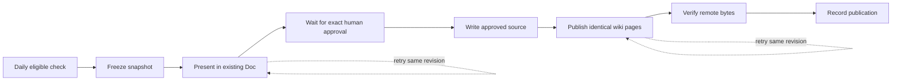

# Daily wiki reviews

The wiki changes only after the configured human approves an exact review revision in one
existing Google Doc. The checked-in [policy](wiki-maintenance-policy.md) defines the reader-first
layout. The [writing skill](../.github/skills/readable-architecture-doc/SKILL.md) teaches the method;
the workflow and controller enforce it.

## Review and approval

At 16:17 UTC each day, the workflow checks for changed source or issue inputs. Its persistent
state also limits new review creation to once in any rolling 24 hours, including manual runs.
Hourly approval-only runs cannot generate a proposal. GitHub schedules can be delayed; the state
gate, not the expected start time, is authoritative.

A pending review stays frozen. Its section in the existing Doc gives a summary, revision number,
content digest, conflicting open requirements, and full-page previews pinned to an immutable repository commit. The daily job
does not edit that section while it is awaiting approval. New inputs wait for a later revision.
Human comments remain untouched; the updater never adds comment replies as the human.

Post exactly **Approve wiki revision N** in a new comment or reply after reading that revision.
The configured email must match the Google-provided comment author; missing identity fails
closed. Edited old comments, deleted/resolved threads, and approvals of other revisions do not
count. Arbitrary feedback is not an approval: ask the task agent to reconcile it into the policy
and a revised proposal. Do not manually edit an awaiting review's text; its checksum deliberately
blocks publication if the reviewed summary has changed.

Once approved, the controller verifies the frozen page snapshot, unchanged policy and accepted
documentation baseline, readability, page navigation, and evidence links. It writes the approved
pages to the repository with an optimistic, non-force update, then publishes identical bytes to
the wiki. It verifies the remote wiki commit and content before recording success. Branch
protection may block the source update; this is a visible failure, not a reason to bypass it.
Source-only success remains pending so a retry resumes publication of the same revision.

## Setup and activation

Merge the implementation through the normal repository review process before activating it.
The old six-hour generator is replaced in the same workflow file and concurrency group. Retire
any remaining old `spec/auto` proposal rather than merging it after the new process is active.
The old ad-hoc `publish-wiki.ps1` writer now refuses execution, preventing a second write path.

Configure these repository **variables**:

| Variable | Value |
| --- | --- |
| `WIKI_REVIEW_DOC_ID` | The ID of the existing task's bound Google Doc; never create another. |
| `WIKI_APPROVER_EMAIL` | The exact Google account email authorized to approve revisions. |

Configure these repository **secrets**, using explicitly provisioned credentials, not credentials
silently copied from a developer's machine:

| Secret | Purpose |
| --- | --- |
| `WIKI_GOOGLE_CLIENT_ID` | OAuth client for the documentation reviewer. |
| `WIKI_GOOGLE_CLIENT_SECRET` | That OAuth client's secret. |
| `WIKI_GOOGLE_REFRESH_TOKEN` | Refresh token with Docs read/write and Drive comment-read access to the bound document. |
| `WIKI_TOKEN` | GitHub credential able to read/write this repository's already-initialized wiki. |

The built-in Actions token needs contents write for the state branch and approved source updates.
The model job has only read access to repository content and no Google or wiki credentials.
Verification and publication run in fresh trusted checkouts, never with model-modified scripts.
Missing credentials cause an explicit failed run. A successful generation is not a publication.

For local operation, supply the same environment variables plus `GITHUB_REPOSITORY` and
`GH_TOKEN`; run `node scripts/spec/reviewCli.mjs publish`. To request a daily proposal, use
workflow dispatch with `propose: true`. It does not bypass either limit.

## Durable state and recovery

`spec/review-state` stores the single `state.json` and the frozen `pages/` snapshot. Commits
use non-force ref updates so concurrent writers cannot both succeed. Each review records its
baseline source, policy hash, complete page digest, snapshot commit, presentation checksum,
approval identity, and publication receipt. Preview URLs remain valid when the state advances.

The state transitions are:

Do not delete or reset the state branch to force another daily review. A damaged state fails
closed rather than treating the limit as empty. Presentation retries recognize the exact same
Doc section rather than duplicating it. A changed source/policy, altered review, or withdrawn
approval blocks further publication. Resolve it deliberately; never apply an old approval to
new content. This initial implementation intentionally has no automatic reject/replace command.

The first reader-first revision may change many pages. Subsequent drafts are instructed to
leave unaffected pages byte-for-byte unchanged. Existing domain topics cannot be deleted.
The source fact check remains separate from human judgement: tests and links do not prove that
every explanatory sentence is true.

## Validation

Run `npx vitest run scripts/spec` for the controller, Google adapter, readability, and workflow
guards. `npm test`, `npm run build`, and `npm run lint` cover the candidate before it is presented.
No credential-bearing live publication is needed to exercise fake-clock, mocked-service,
concurrency, identity, tampering, and retry cases.
