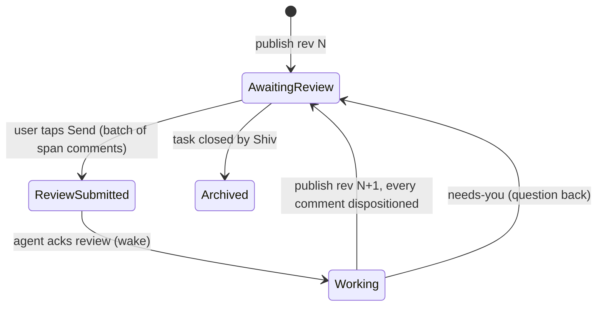

# Docs — a native catch-up document app for Focus Planner

**Status:** proposal, 2026-09-30. Q1–Q3, Q6, Q9 decided; Q4/Q5/Q7/Q8 use the listed defaults unless changed. **Next:** file the action items (§10) and start S0/S1.

## 1. Goal

Replace Google Docs with **Docs**: a small, almost-separate app — think Google Docs, not a journal tab — that lives beside Focus Planner and shares its storage. v1 assumes only what every Focus Planner user has: **tasks and their journals**. Nothing in v1 treats GitHub issues (or any other source) specially.

- A task starts with just its journal (and Telegram thread, if enabled). After a few turns, once the journal gets **too long to catch up on**, the task gets a catch-up doc (§3.1), and from then on the UI offers three links: **💬 Telegram · 📔 Journal · 📄 Catch-up** (§3.2).
- Every task has **at most one primary doc** (its catch-up doc). It can link out to any number of supporting docs, which can link further.
- The agent **publishes** through one sanctioned tool (`fp-docs`) that validates and converts; it never writes the Focus Planner folder directly.
- The phone renders docs with the journal's markdown renderer, in a document layout.
- The user **selects any span and comments** with an intent: ✅ approve · ❓ question · 🔧 do more · 💬 note. There is no whole-document approval.
- The agent cares about the **primary doc**; when it reviews, it automatically follows the primary doc's links and picks up comments on those docs too. It does the work, republishes in place, and dispositions every comment.

Why: every open Google-path defect is an artifact of Google — no author attribution because the agent is Shiv (#422), duplicate binding on rename (#423), UTF-8 corruption (#549), comments misparsed as empty (#502), transient reads indistinguishable from empty (#610, #593), parked docs not polled (#598), MCP missing in the agent session (#570), tables lost on rewrite (catchup-doc SKILL.md:315-326). Local files remove every one.

## 2. What exists today (reuse)

| Piece | Where | Reuse |
|---|---|---|
| Journal grammar (markdown subset, hidden `<!-- -->`) | `docs/spec/Data-Formats.md:117-137`, `src/journalChat.js` | Doc body grammar |
| Renderer (bespoke, no remark/marked) | `JournalChatView` `src/App.jsx:4136-4305`, blocks `:3973-4120` | Extract to shared `<MarkdownBlocks>` |
| Storage providers (IndexedDB / FSA / OneDrive Graph approot, If-Match/412) | `src/storage/*`, `onedrive-provider.js:87-112` | Docs app uses the same providers + auth |
| Record merge w/ clocks + tombstones | `packages/folder-sync/src/merge.js` | Merge comments across devices |
| Sanctioned writer precedent | `plugins/overnight-agent/skills/overnight-agent/write-turn.ps1` | Model for `fp-docs` |
| Observe → ack two-phase read | `oa-state.ps1:514-522`, `checks/observe-bound-docs.mjs` | Same shape, local transport |
| One-writer-per-file trust | `agent-gate.md` | Applied to every Docs file |
| Vite PWA build + deploy | `vite.config.js`, `.github/workflows/deploy.yml` | Second entry point for Docs |

## 3. Docs as a separate app

- **Own entry point**: a second Vite page (`docs.html` → `src/docs-app/main.jsx`) with its own `docs.webmanifest`, icon and name ("Docs"), so it installs as its **own home-screen app**. Same origin as Focus Planner, so it shares the storage provider, OneDrive sign-in and IndexedDB cache without a second login.
- **Own code module**: `src/docs-app/` imports only `src/storage/*` and `packages/docs-core`. No dependency on `App.jsx`; Focus Planner doesn't import Docs either.
- **Deep links** are the only integration: `docs.html#/d/<docId>`, `…?block=b7`, `…?comment=c_…`. Focus Planner's task row / journal header 📄 chip opens the task's primary doc; the doc's task chip opens the task back in Focus Planner. The Telegram bridge can send the same links.

### 3.1 When a task gets its catch-up doc (the threshold)

- **Measure**: *visible* journal words — the journal with `<!-- … -->` comments and markers stripped, i.e. what a reader actually has to wade through. One function in `packages/docs-core` (`journalReadLoad()`), used by both the agent and the app so they never disagree.
- **Default threshold: 1,500 visible words** (~6-minute read), configurable in `user-settings.md` ("Catch-up doc threshold"). On today's 278 journals: median 1,130 words, p75 2,456, p90 6,168 — 1,500 gives **108 tasks (39%)** a doc; the other 61% stay journal-only.
- **Who acts**: the agent. At the end of each turn `fp-docs status --task N` reports `threshold: reached`; if reached and the task has no primary doc, the agent's **next** turn writes the first catch-up doc (a catch-up of the whole journal so far) and publishes it. The user never has to ask. (Stretch: a kebab "Make a catch-up doc now" for shorter tasks.)
- **After the doc exists**: every agent turn updates the doc in place, and the agent's journal entry shrinks to a short pointer — what changed + a link to the doc — so the journal (and its Telegram mirror) stops growing with long status reports.
- **Never below threshold, never twice**: the publisher refuses to create a primary doc for a task under threshold (unless `--force`) or one that already has one.

### 3.2 Three links per task: 💬 Telegram · 📔 Journal · 📄 Catch-up

The app already shows 📔 Journal and, when the journal has a `tg-meta` line, 💬 Telegram (`src/App.jsx:1444-1500` desktop, `:1583-1620` mobile rail, `:1886-1910` kebab). Docs adds the third:

- **📄 Catch-up** appears when `index.json.tasks[id]` exists — driven by the doc actually existing, not by the threshold, so the link always works. Badge: new revision unread, or a `needs-you` disposition. The ★ unread badge stays on 📔.
- **Desktop row**: all three icons side by side (📔 always, 💬 if Telegram, 📄 if doc).
- **Mobile row**: see Q10 (single rail slot today).
- **Everywhere else, the same trio**: journal view header, Docs doc header, and the Telegram thread (the bridge posts the doc link once when it's created). `fp-docs` copies the task's Telegram URL from the journal's `tg-meta` into `index.json` so the Docs app can show 💬 without reading journals.

## 4. Data model — one writer per file

```
Focus Planner/
  docs/
    index.json                ← publisher-owned registry (library listing, task → primary doc)
    d-7kx2m4/                 ← one folder per doc, stable id (survives renames/retitles)
      doc.md                  ← publisher-owned
      response.json           ← publisher-owned (dispositions, revision log)
      review.json             ← app-owned (user comments)
      history/r0004.md        ← publisher snapshots (version history, "what changed")
    d-9a1c0q/ …
```

Single-writer files mean the agent and the user can never collide. The only multi-device case — phone and desktop both writing `review.json` — is a record merge by comment id (`folder-sync`).

### 4.1 `index.json`

```json
{
  "version": 1,
  "tasks": { "123": "d-7kx2m4" },
  "docs": {
    "d-7kx2m4": { "title": "Task 123: Mortgage refinance options", "task": 123, "primary": true,
                  "rev": 4, "updatedAt": "2026-09-30T21:40:00Z", "links": ["d-9a1c0q"],
                  "openDispositions": { "needs-you": 1 } },
    "d-9a1c0q": { "title": "Mortgage options brief", "primary": false,
                  "rev": 2, "updatedAt": "…", "links": [] }
  }
}
```

- `tasks` enforces **exactly one primary doc per task**; the publisher refuses a second.
- Supporting docs have no task binding; they belong to whichever primaries link to them.
- The library screen renders entirely from this one file (one Graph read on the phone).

### 4.2 `doc.md`

```markdown
<!-- docs v1 id=d-7kx2m4 rev=4 published=2026-09-30T21:40:00Z by=overnight-agent -->
# Task 123: Mortgage refinance options

<!-- @b1 -->
**Status: 2 options ready — tell me which one to lock.**

<!-- @b2 -->
See the [Mortgage options brief](doc:d-9a1c0q) for the numbers.
```

- Journal grammar, so any markdown viewer still reads it.
- `<!-- @bN -->` block anchors are assigned by the publisher (never the agent) and carried across revisions by block similarity, so comments survive rewrites.
- Links: `doc:<id>` for Docs, plus normal external links (old Google Docs stay reachable).

### 4.3 `review.json` (user → agent)

```json
{
  "version": 1,
  "comments": {
    "c_01J9…": {
      "rev": 3,
      "anchor": { "block": "b7", "endBlock": "b7", "quote": "fixed 30-year at 5.9%",
                  "prefix": "Option B is a ", "suffix": " with no points" },
      "intent": "question",
      "body": "Is this with or without the escrow change?",
      "createdAt": "2026-09-30T22:01:10Z",
      "reviewId": "rv_01J9…",
      "status": "open",
      "clock": 1727733670000
    }
  },
  "reviews": { "rv_01J9…": { "submittedAt": "2026-09-30T22:03:00Z", "rev": 3 } },
  "readRev": 3
}
```

- Approval is span-scoped: ✅ approves exactly what the selected text proposes.
- A review is a batch of comments sent together; it has no verdict.
- Anchor = block id + W3C TextQuote. Re-anchor: same block + quote → quote anywhere → **outdated** (kept and listed, never lost).
- Drafts (no `reviewId`) stay on-device until **Send**.

### 4.4 `response.json` (agent → user)

```json
{
  "version": 1,
  "rev": 4,
  "revisions": [{ "rev": 4, "at": "…", "summary": "Answered escrow question; added option C" }],
  "dispositions": { "c_01J9…": { "status": "answered", "rev": 4, "blocks": ["b7"], "note": "Without — escrow in b9." } },
  "ackedReview": "rv_01J9…"
}
```

`status`: `answered` · `done` · `needs-you` · `declined`. The answer lives in the prose (catchup-doc rule); the disposition is a one-line pointer to the block.

## 5. The agent's view: primary doc + everything it links to

- The agent is bound to **one doc per task** — the primary (`index.json.tasks[id]`).
- The **review set** of a task = its primary doc plus every doc reachable through `doc:` links (transitive, cycle-safe, capped depth, e.g. 3).
- A submitted review on **any doc in the review set** wakes the task. `fp-docs comments --task 123` returns open comments across the whole set, grouped by doc.
- Publishing a linked doc and updating the primary happen in one `fp-docs publish` call, so a new link and its target land together.
- A supporting doc linked from two tasks' primaries wakes both; dispositions are per-doc, so whichever run handles a comment first resolves it and the other sees it done.

## 6. Lifecycle (per doc)



State is derived from the files, never stored twice. No doc ever reaches "approved"; spans do. Only Shiv closing the task archives its primary doc (supporting docs archive when nothing live links to them).

## 7. Docs app UX (phone-first, Google Docs–like)

**Home (library)**
- Tabs: **Needs you** (unread revisions, `needs-you`, drafts not sent) · **Recent** · **All**.
- Search by title and task number (full-text in v2).
- Each card: title, task chip, rev + "updated 2h ago", badges (unread, needs-you, open comments).

**Doc view**
- App bar: back, title, task chip (→ Focus Planner), overflow: **Outline**, **Version history**, **Comments**.
- Sticky status banner = the doc's bold status line + "r4 · 2h ago".
- **Changed since you last read**: accent bar on changed blocks, "next change" button; `readRev` advances on reaching the end or "Mark read".
- `doc:` links open in-app with back stack; footer "Linked from …".
- Version history: list of revisions with the agent's summary; tap to view that rev with changes highlighted.

**Commenting**
- Native long-press selection → floating pill: **💬 Comment** and one-tap **✅ Approve** (iOS won't let us extend its menu, so we float our own using `Range.getBoundingClientRect()`).
- Fallback: tap-hold a block → "Comment on this paragraph".
- Bottom sheet: intent chips (✅ ❓ 🔧 💬), text, Save draft.
- Highlights via the CSS Custom Highlight API (no DOM mutation), `<mark>` fallback. Multi-block selections anchor to start+end block.
- Comments panel (sheet on phone, side panel on desktop): Open / Outdated / Resolved; reopen a resolved comment.
- Footer **Send to agent (3)** batches drafts so the agent doesn't wake on comment 1 of 5.

## 8. The sanctioned publisher — `fp-docs`

Node CLI in the overnight-agent plugin (`packages/docs-publisher/bin/fp-docs.mjs`) wrapped by a `docs-publish` skill. The overnight agent is the primary caller; any session can use the skill. Drafts are written in the caller's own workspace.

```
fp-docs publish  --task 123 --draft .\primary.md [--base-rev 3] --summary "…" \
                 [--linked new:brief=.\brief.md] [--linked d-9a1c0q=.\brief.md --linked-base-rev 2] \
                 --disposition c_01J9=answered:b7:"Without — see b9" …
fp-docs comments --task 123 [--json]              # open/reopened across the review set, re-anchored
fp-docs ack      --task 123 --review rv_01J9…     # claim a submitted review (→ Working)
fp-docs status   --task 123 [--json]              # per-doc state, rev, open counts
fp-docs lint     --draft .\primary.md
```

- First `publish` for a task creates its primary doc and the `tasks` binding; later calls update it in place.
- `--linked new:<alias>=file` creates a supporting doc; `doc:new:<alias>` in drafts is rewritten to the new id.

**Validation (refuse, non-zero exit, actionable message)**
1. Encoding: UTF-8, no BOM, no mojibake (write-turn corruption classes, #549); LF.
2. Grammar: only the renderer's subset; raw HTML refused except allowed comments.
3. Catch-up contract (primary docs; catchup-doc SKILL.md:207-271): bold status first line, required sections, evidence link on every "verified/fixed/done" claim, no bare `#NNN`.
4. Links: `doc:` targets exist (or are created in the same call); external links well-formed; `--check-links` optional.
5. Every open/reopened comment in the review set dispositioned (or `--partial` with reason).
6. Optimistic concurrency: `--base-rev` must match, else refuse.
7. Size limits so the phone stays fast.

**Format transfers**: `<details>` → fold marker the renderer supports (or flatten); GitHub alerts → labelled blockquotes; smart quotes/`<br>` normalized; block ids assigned/carried; block hashes for change markers; `index.json` updated.

**Write protocol**: temp → atomic rename per file; snapshot to `history/`; doc.md → response.json → index.json with the rev stamped in each so a torn write is detectable and repaired on the next run; the Docs folder path comes from config, never from arguments.

**Enforcement**: skill text; a check (`checks/docs-publisher-stamp.mjs`) flagging any change under `docs/` not stamped by `fp-docs`; optional `preToolUse` hook blocking direct writes to the Focus Planner folder except via `fp-docs`/`write-turn.ps1`.

## 9. Agent loop integration

- **Wake**: `oa-state.ps1 scan` gains `docs_review_submitted` = a review on any doc in a task's review set newer than that doc's `ackedReview`. Local reads remove the transport-failure class (#610/#593); scan covers parked tasks (#598).
- **Binding**: `index.json.tasks` replaces the Google doc-id mapping; no title-search, no duplicates (#423).
- **Attribution**: comments come from the app, so authorship is certain (#422).
- **Turn**: `fp-docs ack` → work → `fp-docs publish` with dispositions → optional one-line journal pointer via `write-turn.ps1` → `mark`. `needs-you` maps to a `blocking` ask.
- **✅ on a span** ⇒ the agent may carry out what that span proposes; if the span explicitly names an agent-gate "always ask" action, the ✅ answers that ask; vaguer text does not. Never closes the task.
- **Threshold**: after each turn, `fp-docs status` reports whether the journal crossed the threshold; first crossing ⇒ next turn creates the primary doc (§3.1). This replaces `ensure-catchup-doc.mjs`'s "create a Google Doc for every task".

## 10. Action items

**Phase 0 — spec (S)**
1. `docs/spec/Domain-docs.md` + `Data-Formats.md` section; JSON schemas for index/review/response; `AGENTS.md` scaffold v5 ("agents never write `docs/`; use fp-docs").

**Phase 1 — core + publisher (M)**
2. `packages/docs-core`: grammar parser extracted from `src/journalChat.js` (journal keeps using it), `journalReadLoad()` threshold measure, block ids + carry-over, re-anchoring, hashing, link graph/review-set traversal.
3. `packages/docs-publisher`: `fp-docs` publish/lint/status with validation, format transfers, atomic writes, history, index. Golden-file Vitest fixtures.

**Phase 2 — Docs app, read-only (M)**
4. Extract `<MarkdownBlocks>` from `JournalChatView` (no behaviour change; snapshot tests).
5. Second Vite entry `docs.html` + `docs.webmanifest` + icon; `src/docs-app/` shell with hash routing.
6. Library (Needs you / Recent / All, search) from `index.json`; doc view with status banner, change markers, `doc:` links, outline, version history.
7. Focus Planner: the three-link trio (§3.2) on task rows (desktop + mobile), journal header, kebab; 📄 badge; hide `docs/` in `src/fileTreeFilter.js`.

**Phase 3 — comments (L)**
8. Selection pill (💬 / ✅), tap-hold fallback, comment sheet, Custom Highlight rendering.
9. `review.json` store via providers with If-Match + folder-sync record merge.
10. Comments panel (Open/Outdated/Resolved, reopen), Send-to-agent batching, dispositions shown inline.

**Phase 4 — agent loop (M)**
11. `fp-docs comments` / `ack` over the review set; `oa-state.ps1` wake signal and binding; threshold check at turn end → first doc on crossing; short journal pointer once a doc exists.
12. Skills: `docs-publish` (new), `catchup-doc` (Docs target), `overnight-agent`. (Other skills such as gh-issue-work are unchanged in v1.)
13. Publisher-stamp check; retire `ensure-catchup-doc.mjs` / `observe-bound-docs.mjs` at cut-over.

**Phase 5 — migration & cut-over (S)**
14. Dual-publish (Google + Docs) for active tasks ~1 week.
15. Import unresolved Google comments as outdated comments; add a link to the old Google Doc in each primary doc.
16. Remove the Google path; close #422, #423, #502, #570, #593, #598, #610 with evidence.

**Stretch**: full-text search; Telegram ping on new rev / `needs-you`; side-by-side diff; desktop side-panel polish.

## 11. Staging

Each stage ships behind a `docsApp` flag in `settings.json` and is useful on its own.

> **Revised order (2026-09-30): UX first.** The app side of S0–S2 (reader, library, trio links, commenting) is built first against a hand-made mock doc on a sample task, so the commenting experience can be tuned on a real phone. The `fp-docs` publisher and the agent loop come after. The feature is gated on `docs/index.json` existing, so it needs no flag.

| Stage | Ships | You can… | Exit criteria (evidence) |
|---|---|---|---|
| **S0 Spike** (parallel, throwaway) | Selection + floating pill + Custom Highlight prototype in an installed PWA | try commenting on your iPhone | Screen recording; go/no-go on native selection vs. tap-hold |
| **S1 Publish + read** | Spec, docs-core (incl. threshold), `fp-docs publish/lint/status`, Docs app library + reader, three-link trio | a long task shows 📄 and you read its catch-up doc in Docs instead of Google | Vitest green; a real over-threshold task gets its primary doc (+ one linked doc) and the trio, screenshotted on phone |
| **S2 Comments** | Selection → comments, review store + merge, panel, Send | comment on spans; agent reads via `fp-docs comments` | Comments round-trip phone ↔ desktop without loss |
| **S3 Agent loop** | Wake over the review set, ack, dispositions enforced, skills, stamp check | full loop: comment on primary or a linked doc → agent wakes → republishes | One task completes ≥2 cycles unattended, including a comment on a linked doc |
| **S4 Cut-over** | Dual-publish, comment import, Google path removed | stop using Google Docs | A week with no Docs-only regressions; Google-defect issues closed |

From S1 on, this feature's own catch-up doc lives in Docs.

## 12. Deliverables

- **Spec**: `Domain-docs.md`, `Data-Formats.md` section, `schemas/docs-{index,review,response}.schema.json`, `AGENTS.md` v5.
- **Packages**: `packages/docs-core`, `packages/docs-publisher` (`fp-docs`), golden fixtures.
- **App**: `docs.html`, `docs.webmanifest`, icon, `src/docs-app/` (Library, DocView, Outline, VersionHistory, CommentSheet, CommentsPanel, reviewStore), shared `<MarkdownBlocks>`, Focus Planner 📄 chip. Vitest beside each; phone screenshots per stage.
- **Agent**: `docs-publish` skill; updated `catchup-doc`, `overnight-agent`; `oa-state.ps1` signal; `checks/docs-publisher-stamp.mjs`; optional write-blocking hook.
- **Tracking**: one GitHub epic + one issue per action item, labelled by stage; one Docs catch-up doc per stage.

## 13. Risks

- **iOS PWA selection** is the riskiest piece → S0 spike first; tap-hold-block fallback guarantees usability.
- **Block-id carry-over** on heavy rewrites orphans comments → kept as outdated, never dropped.
- **Link fan-out**: a primary linking many docs widens the review set → depth cap + index-only traversal keeps it cheap.
- **Hand-edits** under `docs/` break the stamp → still renders; check flags it; next publish needs `--adopt-external-edit`.
- **Two apps, one origin**: service-worker scope must cover both entries without one app's update breaking the other → single SW, shared cache version.
- Local repo checkout is 71 commits behind origin; line refs may have drifted.

## 14. Open questions

| # | Question | Decision / default |
|---|---|---|
| Q1 | Who publishes? | **Decided:** overnight agent primarily; `fp-docs` CLI + skill in the plugin, usable by any session. |
| Q2 | Scope | **Decided:** v1 replaces Google Docs for planner tasks only. No special handling for GitHub issues or any other source; gh-issue-work is unchanged. |
| Q3 | Approval | **Decided:** span-scoped only; ✅ on a span explicitly naming a gated action answers that ask. |
| Q4 | Can agents read `docs/` directly? | Default: read allowed; comments consumed only via `fp-docs comments`. |
| Q5 | Desktop commenting in v1? | Default: same components; test-gate on phone. |
| Q6 | Docs per task | **Decided:** exactly one primary doc per task; it links out to supporting docs; the agent follows links. |
| Q7 | Migration | Default: dual-publish 1 week; import unresolved Google comments. |
| Q8 | History retention | Default: last 20 revs per doc. |
| Q9 | GitHub issues | **Out of scope for v1.** (Later: issues could become supporting docs linked from a task's primary doc.) |
| Q10 | Mobile row has one rail slot today (💬 if Telegram else 📔; the other in the kebab). With three links, what goes on the row? | open — asking |
| Q11 | Threshold default | Default 1,500 visible words, configurable; revisit after a week of real use. |
| Q12 | Journal after a doc exists | Default: agent's journal turns shrink to a pointer + link; full status lives only in the doc. |
